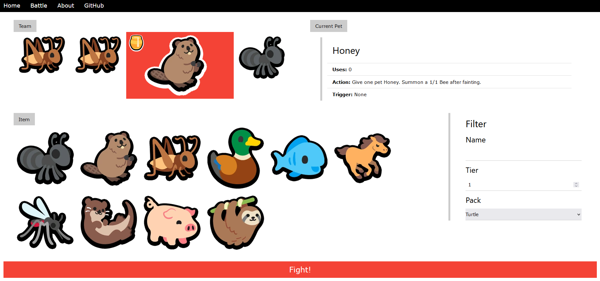

# SAPTester
[](https://github.com/koisland/SAPTester/actions/workflows/pages.yaml)
[](https://github.com/koisland/SAPTester/actions/workflows/fly.yaml)
[](https://github.com/koisland/SAPTester/actions/workflows/ci.yaml)

Front-end website and REST API for the [`saptest`](https://github.com/koisland/SuperAutoTest) library.

</img>

> View @ [`https://koisland.github.io/SAPTester/`](https://koisland.github.io/SAPTester/)

## API
To view database fields, refer to the [`saptest` `db` module documentation](https://docs.rs/saptest/latest/saptest/db/index.html).

Deployed on `fly.io` in single region atm.
* 'sjc' - (*San Jose, California (US)*)

### **Pets**
*Get all pets.*
```bash
curl -X GET "https://saptest.fly.dev/db/pets"
```

*Get all pets from a specific pack.*
```bash
curl -X GET "https://saptest.fly.dev/db/pets?pack=Turtle"
```

*Get all tier 1 pets.*
```bash
curl -X GET "https://saptest.fly.dev/db/pets?tier=1"
```

*Get all tier 1 pets that have a faint trigger.*
```bash
curl -X GET "https://saptest.fly.dev/db/pets?tier=1&effect_trigger=Faint"
```

### **Foods**
*Get all pets.*
```bash
curl -X GET "https://saptest.fly.dev/db/foods"
```

*Get all foods from a specific pack.*
```bash
curl -X GET "https://saptest.fly.dev/db/foods?pack=Turtle"
```

*Get all tier 1 foods.*
```bash
curl -X GET "https://saptest.fly.dev/db/foods?tier=1"
```

*Get all tier 6 foods that have a random effect.*
```bash
curl -X GET "https://saptest.fly.dev/db/foods?tier=6&random=true"
```

### Battle
Test a battle between two teams.

```bash
curl -X POST "https://saptest.fly.dev/battle" -H "Content-Type: application/json" -d "@file.json"
```

`file.json`
```json
{
    "friend_team": {
        "name": "The Super Auto Pets",
        "pets": [
            {
                "name": "Dog",
                "attack": 3,
                "health": 4,
                "level": 1,
                "item": "Honey"
            },
            {
                "name": "Slot"
            },
        ]
    },
    "enemy_team": {
        "name": "The Super Auto Pets 2",
        "pets": [
            {
                "name": "Dog",
                "attack": 3,
                "health": 4,
                "level": 1,
                "item": "Honey"
            },
            {
                "name": "Dog",
                "attack": 3,
                "health": 4,
                "level": 1,
                "item": "Honey"
            }
        ]
    }
}

```


## Sources
* https://www.w3schools.com/w3css/w3css_references.asp
* https://fasterthanli.me/articles/remote-development-with-rust-on-fly-io
* https://github.com/dxps/fullstack-rust-axum-dioxus-rwa/blob/main/backend/src/bin/server.rs
* https://quickchart.io/documentation/
